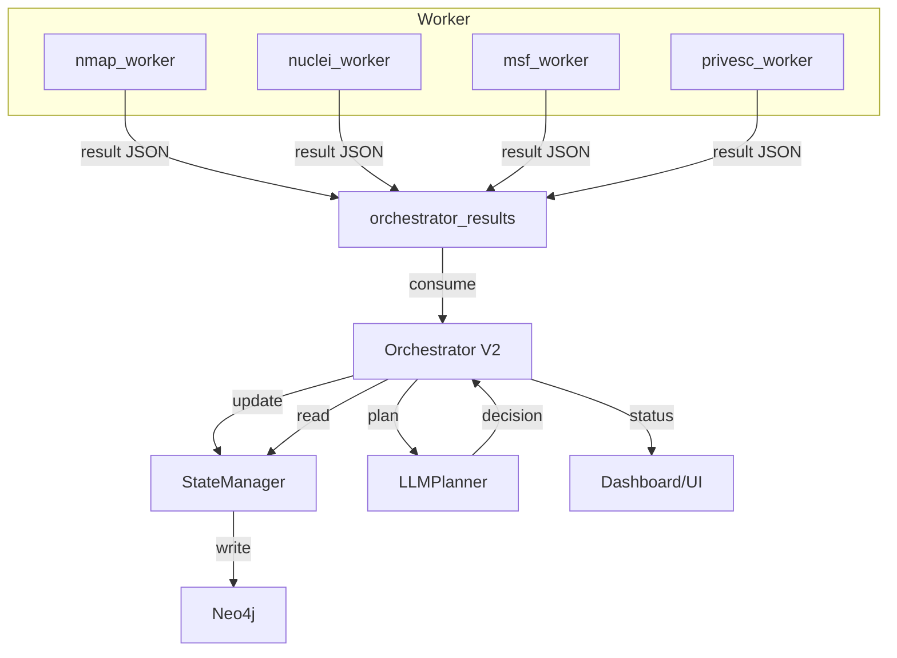

# A.A.P.T. - Sistema di Pianificazione Autonoma

## Panoramica

A.A.P.T. (Advanced Agent Penetration Testing) ora include un sistema di pianificazione autonoma che utilizza l'intelligenza artificiale per automatizzare completamente il processo di pentesting. Il sistema utilizza il modello Phi-3Microsoft per analizzare lo stato del sistema e prendere decisioni autonome sui prossimi scan da eseguire.

## Architettura del Sistema Autonomo

### Componenti Principali
1. **StateManager** (`state_manager.py`)
   - Interroga Neo4 ottenere lo stato del sistema
   - Fornisce riassunti strutturati per il planner LLM
   - Traccia target, scan, findings e vulnerabilità
2 **LLMPlanner** (`llm_planner.py`)
   - Utilizza Phi-3 la pianificazione autonoma
   - Analizza lo stato del sistema e decide le prossime azioni
   - Genera piani di scan ottimizzati
3. **Orchestrator V2* (`orchestrator_v2.py`)
   - Coordina StateManager e LLMPlanner
   - Esegue il loop OSSERVA-PENSA-AGISCI
   - Gestisce l'esecuzione dei task tramite RabbitMQ
   - **Supporta azioni: nmap_scan, nuclei_scan, msf_exploit, privesc, analyze, wait**

## Installazione e Configurazione

### Prerequisiti1. **Modelli LLM**: Assicurati che il modello Phi-3 sia presente in:
   ```
   ./models/Microsoft/phi-3mini-4k-instruct-q43mini-4k-instruct-q4.gguf
   ```

2**Dipendenze**: Le nuove dipendenze sono già incluse in `requirements.txt`:
   - `llama-cpp-python==00.2.23
   - `neo40.1`
   - `requests==2.310 Avvio del Sistema Autonomo

#### Modalità Autonoma Completa
```bash
# Avvia tutti i servizi inclusi l'orchestrator V2
docker-compose --profile autonomous up -d
```

#### Modalità Manuale (solo servizi base)
```bash
# Avvia solo i servizi base senza autonomia
docker-compose up -d
```

## Utilizzo

### 1. Avvio Automatico

Una volta avviato, lOrchestrator V2:
- Si connette automaticamente a Neo4j e RabbitMQ
- Carica il modello Phi-3 Inizia il loop di pianificazione autonoma ogni 30di

###2Monitoraggio

#### Healthcheck Endpoints
- **Orchestrator V2**: `http://localhost:5151/health`
- **Stato Sistema**: `http://localhost:5151/status`

#### Logs
```bash
# Visualizza logs dell'orchestrator V2
docker logs orchestrator_v2 -f
```

### 3. Controllo Manuale

#### Azione Manuale
```bash
# Esempio: avviare una scansione nmap
curl -X POST http://localhost:5151/manual_action \
  -H "Content-Type: application/json" \
  -d '{"action": "nmap_scan", "target": "192.168.1.10", "parameters": {"ports": "1-1000"}}'

# Esempio: avviare privilege escalation su una shell
curl -X POST http://localhost:5151/manual_action \
  -H "Content-Type: application/json" \
  -d '{"action": "privesc", "target": "192.168.1.10", "parameters": {"shell_id": "shell-uuid", "script": "linpeas"}}'
```

## Logica di Pianificazione

### Ciclo OSSERVA-PENSA-AGISCI

1. **OSSERVA**: Lo StateManager interroga Neo4j per ottenere:
   - Numero di target attivi/completati/falliti
   - Scan in corso e completati
   - Findings e vulnerabilità scoperte
   - Task pendenti
2. **PENSA**: Il LLMPlanner analizza lo stato e decide:
   - Quale target scansionare
   - Che tipo di scan eseguire (nmap/nuclei/msf_exploit/privesc)
   - Parametri ottimali per lo scan o exploit
   - Se attendere che i task in corso terminino
3. **AGISCI**: L'Orchestrator V2
   - Invia task a RabbitMQ (nmap_tasks, nuclei_tasks, msf_tasks, privesc_tasks)
   - Monitora l'esecuzione
   - Aggiorna lo stato

### Strategie di Pianificazione

Il sistema implementa le seguenti strategie:

- **Priorità Target**: Target senza scan completati hanno priorità
- **Sequenza Logica**: nmap → nuclei → msf_exploit → privesc (se shell ottenuta)
- **Ottimizzazione**: Evita sovraccarico del sistema
- **Adattamento**: Si adatta ai risultati precedenti

### TOOLBOX (Azioni Disponibili)

- **nmap_scan**: Scansione porte/servizi
- **nuclei_scan**: Scansione vulnerabilità
- **msf_exploit**: Sfrutta vulnerabilità con Metasploit
- **privesc**: Esegue script di privilege escalation (linpeas, winPEAS) su shell ottenuta (parametri: shell_id, script)
- **analyze**: Analizza risultati e suggerisce prossimi passi
- **wait**: Attende completamento task

## Flusso Dati End-to-End

Il sistema A.A.P.T. ora utilizza uno **schema JSON standardizzato** per tutti i risultati dei worker, garantendo un flusso dati robusto e automatizzabile tra i moduli.

### Schema dei Messaggi di Risultato
Vedi `result_schema.md` per la specifica completa. Ogni worker pubblica su `orchestrator_results` (o `results_queue`) un messaggio come:

```json
{
  "task_id": "uuid",
  "worker_type": "nmap_worker" | "nuclei_worker" | "msf_worker" | "privesc_worker",
  "target": "192.168.1.10",
  "status": "success" | "failure",
  "timestamp": "2024-10-27T10:00:00Z",
  "summary": "Breve riassunto leggibile.",
  "data": { ... },
  "raw_output_path": "/path/to/log.txt" // opzionale
}
```

### Percorso del Dato
1. **Worker** esegue il task e pubblica il risultato standardizzato su `orchestrator_results`.
2. **Orchestrator V2** ascolta la coda, chiama `StateManager.process_result_message` per aggiornare Neo4j.
3. **StateManager** aggiorna nodi/relazioni in base a `worker_type` e `data`.
4. **LLMPlanner** e orchestrator leggono lo stato aggiornato per pianificare la prossima azione.
5. **UI** e API possono visualizzare lo stato in tempo reale.

### Diagramma del Flusso Dati



### Vantaggi
- Parsing e automazione unificati
- Stato sempre aggiornato e query-abile
- Facilità di estensione per nuovi worker
- Debug e audit semplificati (raw_output_path)

## Test del Sistema

### Test Automatici
```bash
# Esegui tutti i test
cd aapt_framework/orchestrator
python test_autonomous_system.py
```

### Test Manuali
```bash
# Test connessione Neo4j
curl http://localhost:5151tus

# Test healthcheck
curl http://localhost:5151lth
```

## Configurazione Avanzata

### Parametri LLM
Modifica `llm_planner.py` per personalizzare:
- Temperatura del modello (default: 0.1)
- Numero di token massimi (default: 512)
- Prompt di sistema

### Ciclo di Pianificazione
Modifica `orchestrator_v2per personalizzare:
- Intervallo tra cicli (default: 30secondi)
- Timeout di connessione
- Logging verbosità

### Prompt Personalizzati
Il sistema utilizza prompt strutturati per:
- Pianificazione generale
- Analisi target specifici
- Raccomandazioni di scan

## Troubleshooting

### Problemi Comuni1**Modello non trovato**
   ```
   FileNotFoundError: Modello non trovato
   ```
   - Verifica che il modello sia in `./models/Microsoft/phi-3mini-4k-instruct-q4`
   - Controlla i permessi del file2 **Connessione Neo4j fallita**
   ```
   Connection refused to neo4j:7687 ```
   - Verifica che Neo4j sia in esecuzione
   - Controlla le credenziali in docker-compose.yml

3 **Errore RabbitMQ**
   ```
   Connection refused to rabbitmq:5672 ```
   - Verifica che RabbitMQ sia in esecuzione
   - Controlla le credenziali

### Debug

#### Logs Dettagliati
```bash
# Abilita debug logging
export LOG_LEVEL=DEBUG
docker-compose --profile autonomous up -d
```

#### Test Componenti Singoli
```bash
# Test solo LLMPlanner
python -cfromllm_planner import LLMPlanner; p = LLMPlanner(); print('OK')"

# Test solo StateManager
python -c "from state_manager import StateManager; s = StateManager(); print(OK
```

## Estensioni Future

### Possibili Miglioramenti

1**Multi-Modello**: Supporto per modelli diversi (Llama, GPT, etc.)
2. **RL Agent**: Implementazione di reinforcement learning
3**Analisi Avanzata**: Integrazione con tool di analisi esterni4 **Dashboard**: UI dedicata per il monitoraggio dell'autonomia
5. **API REST**: Endpoint per controllo remoto

### Integrazione con Altri Tool

Il sistema può essere esteso per supportare:
- Nmap avanzato (script personalizzati)
- Nuclei templates personalizzati
- Altri scanner di vulnerabilità
- Tool di post-exploitation

## Sicurezza

### Considerazioni

- Il sistema opera in ambiente controllato
- I modelli LLM sono locali (nessuna connessione esterna)
- Tutte le comunicazioni sono interne al cluster Docker
- Credenziali sono configurabili tramite variabili d'ambiente

### Best Practices

1**Ambiente Isolato**: Esegui sempre in ambiente di test
2. **Credenziali Sicure**: Cambia le password di default3 **Monitoraggio**: Controlla sempre i log per attività sospette
4ckup**: Fai backup regolari del database Neo4j

## Supporto

Per problemi o domande:
1. Controlla i logs: `docker logs orchestrator_v2`2. Esegui i test: `python test_autonomous_system.py`
3. Verifica la configurazione in `docker-compose.yml`
4. Controlla la documentazione dei componenti

---

**Nota**: Questo sistema rappresenta un avanzamento significativo nell'automazione del pentesting. Utilizzalo responsabilmente e sempre in ambienti autorizzati. 

## Esportazione e Integrazione

- **Esporta CSV per Burp**: dalla dashboard, clicca “Esporta per Burp” per scaricare gli asset prioritari in formato CSV compatibile con Burp Suite (host, motivazione, priorità).
- **Esporta JSON**: clicca “Esporta JSON” per scaricare la stessa lista in formato JSON.
- **Integrazione Slack**: imposta la variabile d’ambiente `AAPT_SLACK_WEBHOOK` per ricevere notifiche automatiche su nuovi obiettivi critici direttamente su Slack.
- **Azioni manuali avanzate**: dalla dashboard puoi lanciare nuclei, nmap, msf exploit con parametri custom su ogni asset interessante.

## Notifiche Real-Time

- **Dashboard**: toast/alert automatici per ogni nuovo obiettivo ad alta priorità.
- **Slack**: ogni nuovo obiettivo high priority genera una notifica push sul canale configurato.
- **Polling**: la dashboard aggiorna la lista obiettivi ogni 10 secondi.

## Knowledge Base Ibrida

- **SQLite**: tutti i risultati grezzi di subfinder, httpx, naabu vengono salvati in `recon.db` (milioni di record, query veloci).
- **Neo4j**: solo asset attivi/interessanti, con relazioni ricche (tech, vuln, findings, shell).
- **Script di pulizia**: `scripts/neo4j_cleanup.py` mantiene Neo4j leggero e aggiornato.

## Pipeline Passiva/Asincrona

1. subfinder → 2. httpx → 3. naabu → 4. nuclei mirato/manuale → 5. nmap/msf solo su trigger
- Ricognizione continua, probe e scan leggeri, nuclei solo su asset ad alto impatto.
- Dashboard e notifiche ti guidano solo su ciò che conta davvero. 