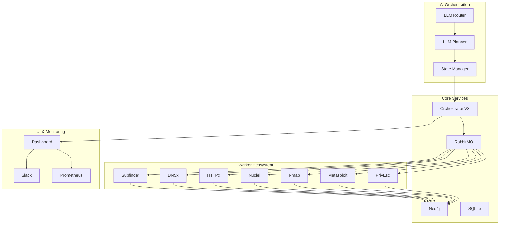

# 🚀 A.A.P.T. Framework - Guida Completa

> **Advanced Agent Penetration Testing** - Framework di pentesting autonomo basato su AI

[](https://github.com/smokey/aapt)
[](LICENSE)
[](https://python.org)

## 🎯 Panoramica

A.A.P.T. è un framework rivoluzionario per l'automazione del pentesting che utilizza l'intelligenza artificiale per orchestrare completamente il processo di sicurezza. Il sistema implementa un ciclo **OSSERVA-PENSA-AGISCI** utilizzando modelli LLM per prendere decisioni autonome sui prossimi scan da eseguire.

### ✨ Caratteristiche Principali

- 🤖 **Autonomia AI-Driven**: Pianificazione autonoma con modelli LLM (Phi-3, Llama 3)
- 🔄 **Pipeline Reattiva**: subfinder → dnsx → httpx → nuclei → nmap/msf
- 🏗️ **Architettura Microservizi**: 12+ worker specializzati containerizzati
- 📊 **Knowledge Base Ibrida**: SQLite + Neo4j per gestione dati ottimale
- 🚀 **Production-Ready**: Kubernetes, KEDA autoscaling, monitoring completo
- 🔒 **Sicurezza Avanzata**: Crittografia, validazione input, error handling

## 🏗️ Architettura



## 🚀 Quick Start

### 1. Setup Sicuro

```bash
# Clona il repository
git clone https://github.com/smokey/aapt.git
cd aapt/aapt_framework

# Setup sicuro con credenziali generate automaticamente
python scripts/setup_secure.py

# Configura API keys (opzionale)
nano .env
```

### 2. Download Modelli LLM

```bash
# Crea directory modelli
mkdir -p models/Microsoft/phi-3-mini-4k-instruct-q4/
mkdir -p models/Meta/meta-llama-3-8b-instruct.Q4_K_M/

# Scarica modelli (esempio con wget)
wget -O models/Microsoft/phi-3-mini-4k-instruct-q4/Phi-3-mini-4k-instruct-q4.gguf \
  https://huggingface.co/microsoft/Phi-3-mini-4k-instruct-gguf/resolve/main/Phi-3-mini-4k-instruct-q4.gguf

wget -O models/Meta/meta-llama-3-8b-instruct.Q4_K_M/meta-llama-3-8b-instruct.Q4_K_M.gguf \
  https://huggingface.co/meta-llama/Meta-Llama-3-8B-Instruct-gguf/resolve/main/meta-llama-3-8b-instruct.Q4_K_M.gguf
```

### 3. Avvio

```bash
# Modalità base (senza autonomia)
docker-compose up -d

# Modalità autonoma completa
docker-compose --profile autonomous up -d

# Verifica stato
curl http://localhost:5000/api/status
```

### 4. Accesso Dashboard

- **Dashboard**: http://localhost:5000
- **Neo4j Browser**: http://localhost:7474 (neo4j/password_dal_.env)
- **RabbitMQ Management**: http://localhost:15672 (aapt_user/password_dal_.env)

## 🎮 Utilizzo

### Dashboard Web

La dashboard fornisce:
- 📊 **Monitoring Real-time**: Stato scansioni, risultati, metriche
- 🎯 **Target Management**: Gestione obiettivi, priorità, esportazione
- 🔧 **Azioni Manuali**: Lanciare scan specifici con parametri custom
- 📈 **Analytics**: Grafici Neo4j, trend, statistiche

### API REST

```bash
# Avvia scansione
curl -X POST http://localhost:5000/api/scan \
  -H "Content-Type: application/json" \
  -d '{"target": "example.com"}'

# Azioni manuali avanzate
curl -X POST http://localhost:5152/manual_action \
  -H "Content-Type: application/json" \
  -d '{
    "action": "nmap_scan",
    "target": "192.168.1.10",
    "parameters": {"ports": "1-1000", "scan_type": "nse"}
  }'

# Esporta per Burp Suite
curl http://localhost:5000/api/export_burp -o burp_targets.csv
```

### Sistema Autonomo

Il sistema autonomo opera continuamente:

1. **OSSERVA**: Analizza stato Neo4j, asset interessanti, task pendenti
2. **PENSA**: LLM decide prossime azioni basandosi su contesto
3. **AGISCI**: Esegue scan, exploit, privilege escalation automaticamente

## 🔧 Configurazione Avanzata

### OPSEC Profiles

```bash
# Stealth mode (lento, discreto)
export AAPT_NMAP_TIMING=T0
export AAPT_HTTPX_RATE_LIMIT=50

# Aggressive mode (veloce, intenso)
export AAPT_NMAP_TIMING=T5
export AAPT_MASSCAN_RATE=10000
```

### Kubernetes Production

```bash
# Deploy completo su Kubernetes
kubectl apply -f k8s/namespace.yaml
kubectl apply -f k8s/secrets-secure.yaml
kubectl apply -f k8s/rabbitmq.yaml
kubectl apply -f k8s/neo4j.yaml
kubectl apply -f k8s/workers.yaml
kubectl apply -f k8s/keda-autoscaling.yaml

# Monitora autoscaling
kubectl get scaledobjects -n aapt
```

### Integrazione Slack

```bash
# Configura webhook Slack per notifiche
export AAPT_SLACK_WEBHOOK="https://hooks.slack.com/services/YOUR/WEBHOOK/URL"
```

## 📊 Monitoring e Observability

### Health Checks

```bash
# Orchestrator V3
curl http://localhost:5152/health

# Worker status
curl http://localhost:8080/health  # nmap_worker
curl http://localhost:8082/health  # nuclei_worker
curl http://localhost:8090/health  # httpx_worker

# Error monitoring
curl http://localhost:8080/errors  # Errori nmap_worker
```

### Prometheus Metrics

```bash
# Metriche disponibili
curl http://localhost:5000/metrics

# Esempi metriche:
# - aapt_results_total
# - aapt_interesting_targets_total
# - aapt_errors_total
```

### Logs Centralizzati

```bash
# Logs Docker
docker-compose logs -f orchestrator_v3
docker-compose logs -f nmap_worker

# Logs Kubernetes
kubectl logs -f deployment/orchestrator-v3 -n aapt
kubectl logs -f deployment/nmap-worker -n aapt
```

## 🔒 Sicurezza

### Gestione Secrets

Il framework implementa crittografia end-to-end per tutti i secrets:

```python
from common.secrets import get_secure_config

config = get_secure_config()
# Le password sono automaticamente decrittografate
rabbitmq_config = config.get_config('rabbitmq')
```

### Validazione Input

Tutti gli input sono validati per prevenire injection attacks:

```python
from common.secrets import validate_input

if validate_input(target, "target"):
    # Input sicuro
    run_scan(target)
```

### Error Handling

Sistema centralizzato di gestione errori con categorizzazione:

```python
from common.error_handler import ErrorHandler, NetworkError

error_handler = ErrorHandler("worker_name")
error_handler.handle_error(NetworkError("Connection failed"), {"target": target})
```

## 🧪 Testing

### Test Unitari

```bash
# Test sistema autonomo
cd orchestrator
python test_autonomous_system.py

# Test worker specifici
python -m pytest workers/nmap_worker/tests/
python -m pytest workers/nuclei_worker/tests/
```

### Test di Integrazione

```bash
# Test pipeline completa
python scripts/test_pipeline.py --target example.com

# Load testing
python scripts/load_test.py --workers 10 --duration 300
```

## 🚨 Troubleshooting

### Problemi Comuni

#### 1. Modelli LLM non trovati
```bash
# Verifica path modelli
ls -la models/Microsoft/phi-3-mini-4k-instruct-q4/
ls -la models/Meta/meta-llama-3-8b-instruct.Q4_K_M/

# Controlla permessi
chmod -R 755 models/
```

#### 2. Connessione Neo4j fallita
```bash
# Verifica stato container
docker-compose ps neo4j

# Controlla logs
docker-compose logs neo4j

# Test connessione
docker exec neo4j cypher-shell -u neo4j -p $NEO4J_PASS "RETURN 1"
```

#### 3. Worker non risponde
```bash
# Health check
curl http://localhost:8080/health

# Errori dettagliati
curl http://localhost:8080/errors

# Restart worker
docker-compose restart nmap_worker
```

#### 4. RabbitMQ connection error
```bash
# Verifica credenziali
docker-compose logs rabbitmq

# Test connessione
docker exec rabbitmq rabbitmqctl status
```

### Debug Avanzato

```bash
# Abilita debug logging
export LOG_LEVEL=DEBUG
docker-compose up -d

# Monitora queue RabbitMQ
curl -u aapt_user:$RABBITMQ_PASS http://localhost:15672/api/queues

# Analizza Neo4j
docker exec neo4j cypher-shell -u neo4j -p $NEO4J_PASS \
  "MATCH (n) RETURN labels(n), count(n) ORDER BY count(n) DESC"
```

## 📈 Performance Tuning

### Ottimizzazione Worker

```bash
# Aumenta thread HTTPx
export AAPT_HTTPX_THREADS=100

# Riduci rate limit per stealth
export AAPT_HTTPX_RATE_LIMIT=50

# Ottimizza timing Nmap
export AAPT_NMAP_TIMING=T4
```

### Scaling Kubernetes

```bash
# Aumenta repliche worker
kubectl scale deployment nmap-worker --replicas=5 -n aapt

# Modifica autoscaling
kubectl edit scaledobject nmap-worker-autoscale -n aapt
```

## 🤝 Contribuire

### Sviluppo

1. Fork del repository
2. Crea feature branch: `git checkout -b feature/awesome-feature`
3. Commit changes: `git commit -m 'Add awesome feature'`
4. Push branch: `git push origin feature/awesome-feature`
5. Apri Pull Request

### Aggiungere Nuovo Worker

1. Crea directory in `workers/new_worker/`
2. Implementa `main.py` seguendo schema standardizzato
3. Aggiungi `Dockerfile` e `requirements.txt`
4. Configura in `docker-compose.yml`
5. Aggiungi healthcheck endpoint
6. Testa con `python scripts/test_worker.py new_worker`

### Reporting Bug

Usa il template GitHub Issues con:
- Descrizione dettagliata
- Steps per riprodurre
- Logs rilevanti
- Ambiente (Docker/K8s)

## 📚 Documentazione Aggiuntiva

- [Architettura Dettagliata](ARCHITECTURE.md)
- [API Reference](API.md)
- [Deployment Guide](DEPLOYMENT.md)
- [Security Guide](SECURITY.md)
- [Contributing Guide](CONTRIBUTING.md)

## 🏆 Roadmap

### v0.4.0 (Q1 2024)
- [ ] Supporto multi-LLM (GPT-4, Claude)
- [ ] Dashboard avanzata con Grafana
- [ ] Plugin system per worker custom
- [ ] API GraphQL per query complesse

### v0.5.0 (Q2 2024)
- [ ] Reinforcement Learning per ottimizzazione
- [ ] Supporto cloud (AWS, GCP, Azure)
- [ ] Mobile app per monitoring
- [ ] Integration con SIEM/SOAR

## 📄 Licenza

Questo progetto è rilasciato sotto licenza Open Source. Vedi [LICENSE](LICENSE) per dettagli.

## 🙏 Ringraziamenti

- **Sviluppatore principale**: smokey (like nagata)
- **Community**: Tutti i contributor e tester
- **Tool utilizzati**: Nmap, Nuclei, Metasploit, Neo4j, RabbitMQ

---

**⚠️ Disclaimer**: Utilizza questo framework solo su sistemi di tua proprietà o con autorizzazione esplicita. Gli autori non si assumono responsabilità per uso improprio.

---

*A.A.P.T. Framework v0.3.0* - *Advanced Agent Penetration Testing*
